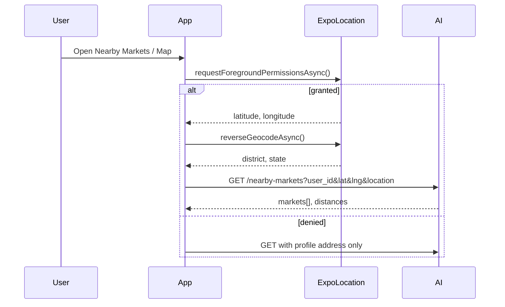
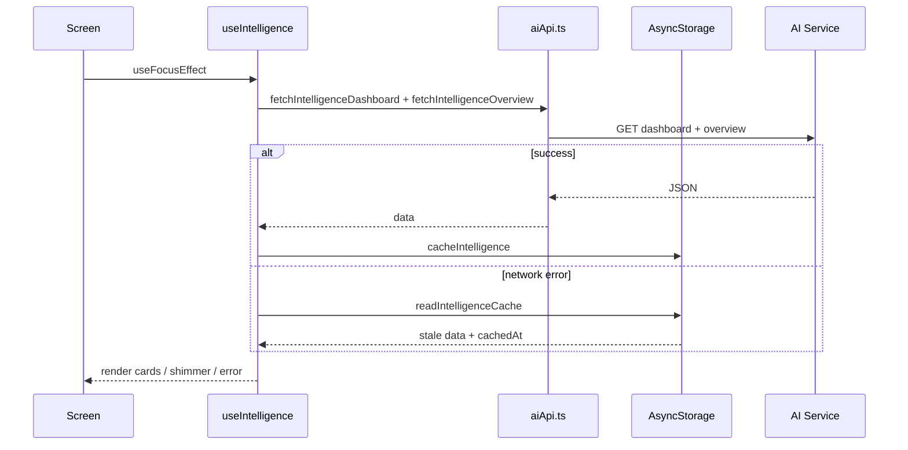

# Android Market Intelligence Implementation

## Overview

Market Intelligence for the AgroElevate Android app (Expo/React Native) mirrors the web platform by consuming the **same external AI Intelligence Service** and **Supabase** data. No duplicate business datasets are stored on-device; only API responses are cached for offline viewing.

**Base URL:** `EXPO_PUBLIC_AI_API_URL` (default `http://localhost:8000`)

---

## Architecture

```
┌─────────────────────────────────────────────────────────────┐
│                    AgroElevate Android App                   │
├─────────────────────────────────────────────────────────────┤
│  Navigation (Expo Router)                                    │
│    farmer/trader/industrialist → intelligence/* screens      │
├─────────────────────────────────────────────────────────────┤
│  UI Layer                                                    │
│    components/intelligence/*                                 │
│    hooks/useIntelligence.ts                                  │
├─────────────────────────────────────────────────────────────┤
│  API Client — lib/aiApi.ts                                   │
│    Dashboard + MI endpoints with server-first, derive-fallback│
├─────────────────────────────────────────────────────────────┤
│  Offline Cache — lib/intelligenceCache.ts (AsyncStorage)     │
│  Location — lib/intelligenceLocation.ts (expo-location)        │
└─────────────────────────────────────────────────────────────┘
          │                              │
          ▼                              ▼
   AI Intelligence Service          Supabase
   /api/intelligence/*              products, orders, profiles
```

### Design principles

1. **Single source of truth** — All intelligence data from AI service APIs (same as web).
2. **No local business logic** — Derivation from dashboard payload only when dedicated endpoint is unavailable (offline fallback using same server response shape).
3. **No auth/marketplace changes** — Existing Supabase auth and marketplace flows untouched.
4. **Role-aware** — Farmer, trader, and industrialist dashboards use role-specific AI endpoints.

---

## API Flow

### Core endpoints (existing)

| Method | Path | Purpose |
|--------|------|---------|
| GET | `/health` | Service health |
| POST | `/api/intelligence/refresh` | Force refresh |
| GET | `/api/intelligence/farmer/dashboard` | Farmer intelligence |
| GET | `/api/intelligence/trader/dashboard` | Trader intelligence |
| GET | `/api/intelligence/industrialist/dashboard` | Industrialist intelligence |
| POST | `/api/intelligence/copilot` | AI chat copilot |

### Market Intelligence endpoints (shared with web)

| Method | Path | Screen |
|--------|------|--------|
| GET | `/api/intelligence/overview` | Overview cards |
| GET | `/api/intelligence/market-prices` | Live Prices |
| GET | `/api/intelligence/nearby-markets` | Nearby Markets, Map |
| GET | `/api/intelligence/price-comparison` | Price Comparison |
| GET | `/api/intelligence/msp` | MSP |
| GET | `/api/intelligence/forecast` | Forecast |
| GET | `/api/intelligence/crop-pricing` | Add Crop Price Assistant |
| GET | `/api/intelligence/benchmark` | Farmer Benchmark |
| GET | `/api/intelligence/benchmark-comparison` | Benchmark Comparison |

**Query params:** `user_id` (required), `location`, `lat`, `lng`, `crop`, `crop_name` as applicable.

When a dedicated endpoint is unavailable, the client falls back to the role dashboard response and maps fields (e.g. `market_predictions` → live prices). Cached responses are served when the network fails.

---

## Database Usage

| Store | Usage |
|-------|-------|
| **Supabase `users`** | `user_id`, profile `address` for location context |
| **Supabase `products`** | Marketplace listings (unchanged); district analytics on AI side |
| **AsyncStorage** | Offline cache only — not a second dataset |

No new Supabase tables are introduced by this module.

---

## Location Flow



**Android permission:** `ACCESS_FINE_LOCATION` (declared in `app.json`).

---

## UI Flow

### Navigation

New bottom tab **Intel** (`analytics` icon) for farmer, trader, industrialist:

```
Home → Intel (Overview)
         ├── Live Prices
         ├── Nearby Markets
         ├── Price Comparison
         ├── Forecast
         ├── MSP
         ├── Recommendations
         ├── Farmer Benchmark
         ├── Benchmark Comparison
         └── Market Map
```

### Crop listing (Price Assistant)

```
Crop Name entered
    → debounced GET /api/intelligence/crop-pricing
    → PricingAssistantCard (mandi, AE avg, suggested price, reasons)
    → Farmer edits final price
    → Submit → Supabase products.insert (unchanged)
```

### Role-specific panels (on Overview)

- **Trader:** Cheapest procurement, demand hotspots, profit opportunities, volatility
- **Industrialist:** Raw material availability, suppliers, procurement forecast, supply risks

---

## Sequence Diagram — Overview Load



---

## Offline Strategy

| Data | Cache key | TTL |
|------|-----------|-----|
| Dashboard + overview | `dash:{uid}:{role}:{location}` | 24h |
| Live prices | `live-prices` | 24h |
| Nearby markets | `nearby-markets` | 24h |
| Price comparison | `price-comparison` | 24h |
| MSP | `msp` | 24h |
| Forecast | `forecast` | 24h |
| Recommendations | `recommendations` | 24h |
| Benchmark | `benchmark` | 24h |
| Benchmark comparison | `benchmark-comparison` | 24h |

UI shows **Last updated** via `formatCacheAge()`. Pull-to-refresh retries live fetch.

---

## File Structure

```
frontend/
├── app/
│   ├── farmer/intelligence/       # Canonical screens
│   ├── trader/intelligence/       # Re-exports
│   └── industrialist/intelligence/
├── components/intelligence/
├── hooks/useIntelligence.ts
├── lib/
│   ├── aiApi.ts                   # Extended MI APIs
│   ├── intelligenceCache.ts
│   ├── intelligenceLocation.ts
│   ├── intelligenceTheme.ts
│   └── intelligenceUtils.ts
```

---

## Testing

### Manual verification checklist

- [ ] Auth login/register unchanged
- [ ] Marketplace browse/buy unchanged
- [ ] Wallet top-up unchanged
- [ ] Orders + royalty relist unchanged
- [ ] Intel tab visible (farmer, trader, industrialist)
- [ ] Overview cards load / shimmer / pull-to-refresh
- [ ] Live prices search, sort, export (Share)
- [ ] Location permission → nearby markets + map
- [ ] Price comparison charts render
- [ ] Add crop → Price Assistant after crop name
- [ ] Benchmark disclaimer visible
- [ ] Offline: airplane mode → cached data + last updated
- [ ] Trader / industrialist role panels on overview

### Commands

```bash
cd frontend
npm run lint
npx tsc --noEmit
npx expo run:android
```

---

## Deployment

1. Set `EXPO_PUBLIC_AI_API_URL` to production AI service in EAS secrets / `.env`.
2. Ensure AI service exposes MI endpoints (or dashboard fallback is acceptable).
3. `eas build --platform android --profile production`
4. Verify location permission strings in `app.json` for Play Store.

---

## Regression Verification

| Module | Status |
|--------|--------|
| Authentication | Unchanged (`AuthContext`, Supabase) |
| Marketplace | Unchanged (`marketplace.tsx`, `products`) |
| Wallet | Unchanged (`walletApi.ts`, Razorpay) |
| Orders | Unchanged (`ordersApi.ts`, `checkout_order`) |
| Royalty | Unchanged (`commerceMeta.ts`) |
| Manufacturing | N/A (industrialist uses shared orders) |
| Notifications | Unchanged |
| AI Copilot API | Available via `sendCopilotMessage` (not new UI in this phase) |

---

## Environment

| Variable | Description |
|----------|-------------|
| `EXPO_PUBLIC_AI_API_URL` | AI Intelligence service base URL |
| `EXPO_PUBLIC_SUPABASE_URL` | Supabase project URL |
| `EXPO_PUBLIC_SUPABASE_ANON_KEY` | Supabase anon key |

---

*Generated for AgroElevate Android Phase 2 — Market Intelligence Integration.*
